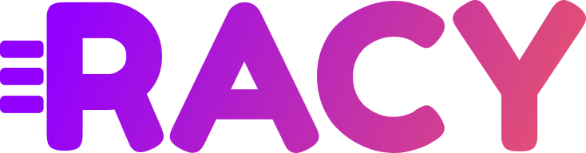

<h1 align="center">
  
</h1>
<p align="center">
  <b>A Windows automation tool</b>
  <br/>
  <br/>
  <a href="https://discord.gg/58qQaQRZGp">
    
  </a>
</p>

<h2>Table of contents</h2>

- [Introduction](#introduction)
- [FAQ](#faq)
- [Contributing](#contributing)

## Introduction

Racy is in it's early days, under development.

The idea of Racy is to provide a full pledged automation tool for Windows. Similar software:

* [AutoHotkey](https://www.autohotkey.com/) - for Windows
* [Hammerspoon](https://www.hammerspoon.org/) - for MacOS
* [Keyboard Maestro](https://www.keyboardmaestro.com/main/), although this one is no-code - for MacOS

## FAQ

* **Why Nim instead of Python (or any other language)?**
  * This is subject to change, but essentially Nim allows making it possible to write code that is much closer to a what a non-techy user would expect, where other languages like Python wouldn't support it, e.g.:
    ```nim
    hotkey "Ctrl+Alt+X":
      messageBox("Hello world")

    # or

    when_active "notepad.exe":
      hotkey "Ctrl+S":
        messageBox("Use a decent app, damn it!")
    ```
* **But you can do that in [insert language here]!**
  * Another reason for choosing Nim is the set of features it has, and that I personally like. Not mentioning that it is relatively simple to pick it up, coming from many languages.

## Contributing

You can help the project a lot without writing any code:

* Join the conversation on [Discord](https://discord.gg/58qQaQRZGp)
* Check [the open issues](https://github.com/NickSeagull/racy/issues)
* Suggest ideas by [creating new issues](https://github.com/NickSeagull/racy/issues/new)